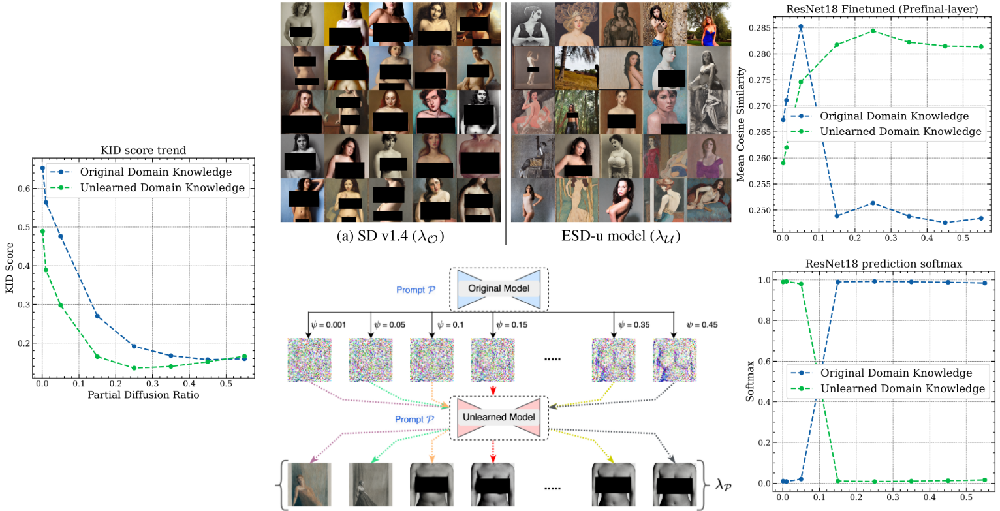

# Unlearning or Concealment? A Critical Analysis and Evaluation Metrics for Unlearning in Diffusion Models

<a href="https://respailab.github.io/unlearning-or-concealment/"></a>
<a href="https://arxiv.org/abs/2409.05668v2"></a>
<a href="https://opensource.org/licenses/BSD-2-Clause"></a>




<br>
<p align="center">

> <a href="https://respailab.github.io/unlearning-or-concealment/">**Unlearning or Concealment? A Critical Analysis and Evaluation Metrics for Unlearning in Diffusion Models**</a>
>
<a href="https://aakash.is-a.dev" target="_blank">Aakash Sen Sharma</a>,
<a href="" target="_blank">Niladri Sarkar</a>,
<a href="https://www.linkedin.com/in/vikram2000b" target="_blank">Vikram Chundawat</a>,
<a href="https://www.usf.edu/engineering/cse/people/mali-ankur.aspx" target="_blank">Ankur A Mali</a>,
<a href="https://murarimandal.github.io/" target="_blank">Murari Mandal</a>


> We expose a significant vulnerability in diffusion model unlearning methods, where an attacker can reverse the supposed erasure of concepts during the inference process. Our approach leverages a novel Partial Diffusion Attack that operates across all layers of the model, successfully recovering forgotten concepts in an unsupervised and data-free manner. While our work currently focuses on the unlearning methods applied to Stable Diffusion 1.4, this limitation highlights the need for further research to generalize these findings to other models and versions.
</p>


# Setup
To set up your python environment:

```shell
python3 -m venv environ
source ./environ/bin/activate
cd diffusers
pip install .
```

## Purpose and Ethical Use
This code is shared for educational purposes and is not intended to be used for any harmful or malicious generation, such as the creation of misleading information, harmful content, or the impersonation of others.

## Acknowledgement:

Our work is based on a diffusers fork by @bghira.


## Citation
If you find this useful for your research, please cite the following:
```bibtex
@misc{sharma2024unlearningconcealmentcriticalanalysis,
  title={Unlearning or Concealment? A Critical Analysis and Evaluation Metrics for Unlearning in Diffusion Models}, 
  author={Aakash Sen Sharma and Niladri Sarkar and Vikram Chundawat and Ankur A Mali and Murari Mandal},
  year={2024},
  eprint={2409.05668},
  archivePrefix={arXiv},
  primaryClass={cs.LG},
  url={https://arxiv.org/abs/2409.05668}
}
```
